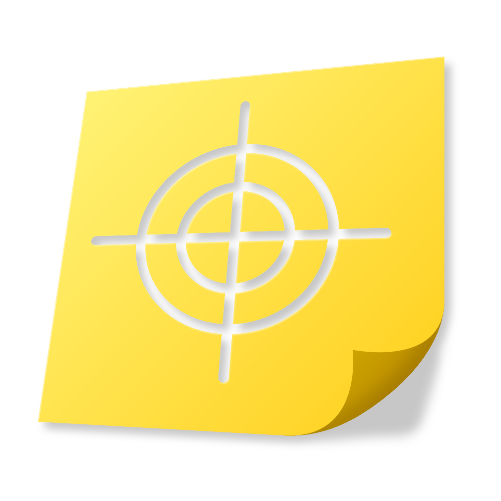

# fusen – stick to things

 
Welcome to a new world of saving notes. 🗃️ 
fusen [付箋](https://www.japandict.com/%E4%BB%98%E7%AE%8B) lets you add sticky notes to any webpage, that stay where you created them.
 
 
Core values of fusen are:

- have your notes only where you need them
- quick space to scribble ideas
- built in markdown support
- quick and easy keyboard shortcuts
- keeps your data locally 
- configuration when notes should show
    - default filtering by domain
    - custom filtering by pathname
- open source 🥳

## In action

## Installation

Download the latest .zip version from the [releases page](https://github.com/Quietscher/fusen/releases). 
Extract it in a folder of your choice.  
Open the [extension page](chrome://extensions/) in your chromium browser. 
(Enable developer mode if you haven't already.) 
Click on "Load unpacked" and select the extracted fusen folder. 
Done! 🎉

## Contribution

Have a look at the issues or open a new one with your ideas :) 
Then fork the repository and create a pull request. 

## Keyboard shortcuts

| Shortcut | Action |
| --- | --- |
| Ctrl + ⌘/⊞ + x | Delete Note |
| Ctrl + ⌘/⊞ + y | New Note |
| Ctrl + ⌘/⊞ + < | Temporarily Close Note |

## Configuration

You can configure the match percentage for the pathname in the extension settings via the popup. 
With it you can define how sticky notes are matched to the current page by the pathname. 
The input defines the percentage of the pathname that must match to show the sticky note. 

## License of used libraries

- marked.js
  - License
    Copyright (c) 2011-2022, Christopher Jeffrey. (MIT License)
  - Repo: [marked](https://github.com/markedjs/marked)
  - Full License at: [here](/libs/marked.LICENSE)
